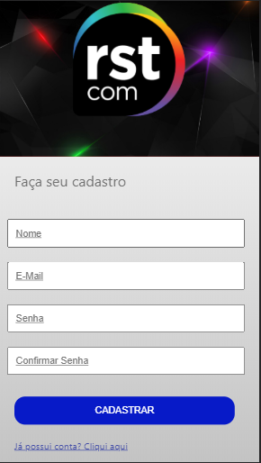
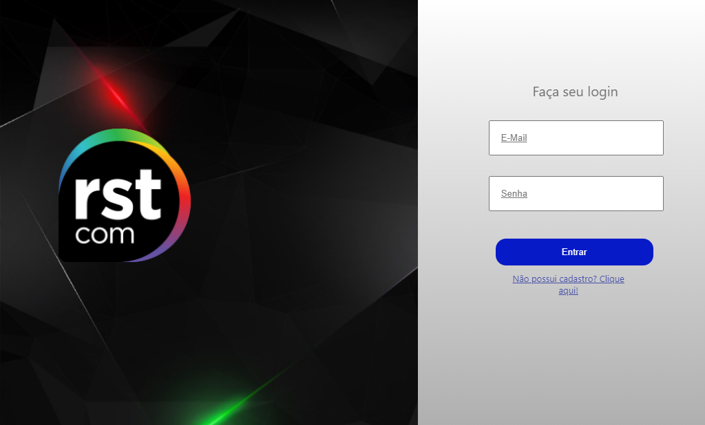
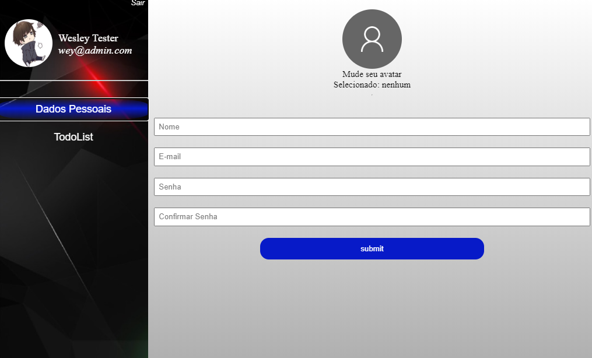
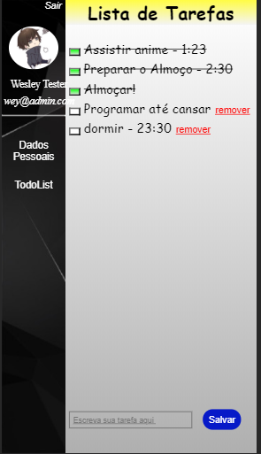

# RSTCOM_React

Projeto realizado em ReactJs, NodeJs e MongoDB. Como processo seletivo e adição ao repositório.

## Installation

- Intalar mongoDB local, ou acessar online.
-- Mudar a diretriz para acesso de banco de dados em back/src/config/database.js
- Instalar dependências do backend
```bash
cd back/
yarn install
```
- Instalar dependências do frontend
```bash
cd front/
yarn install
```
- Startar os dois servidores
```bash
cd front/
yarn start
```
```bash
cd back/
yarn start
```

Agora é só acessar o servidor em http://localhost:3000

## Backend Functions
- Servidor de Imagens
- Login
- Cadastro
- Acesso MongoDb
- Distribuição de Imagens armazenadas
- Update de dados

## Screens







## Contributing
Qualquer contribuição, sugestões de como melhorar a qualidade de código me mande de alguma forma, eu agradecerei muito!


## License
[MIT](https://choosealicense.com/licenses/mit/)